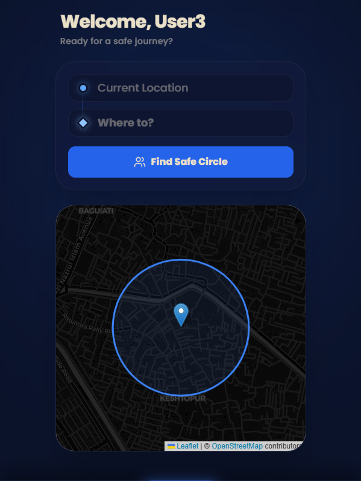
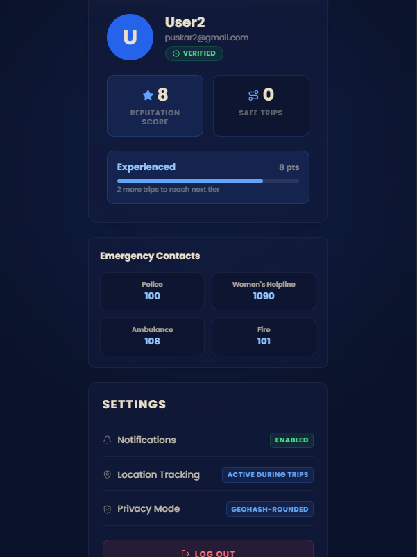
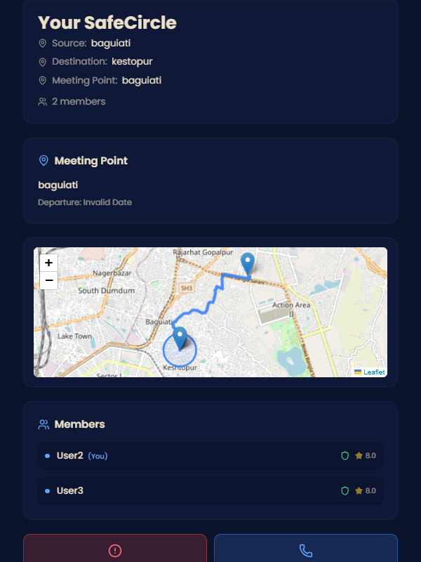
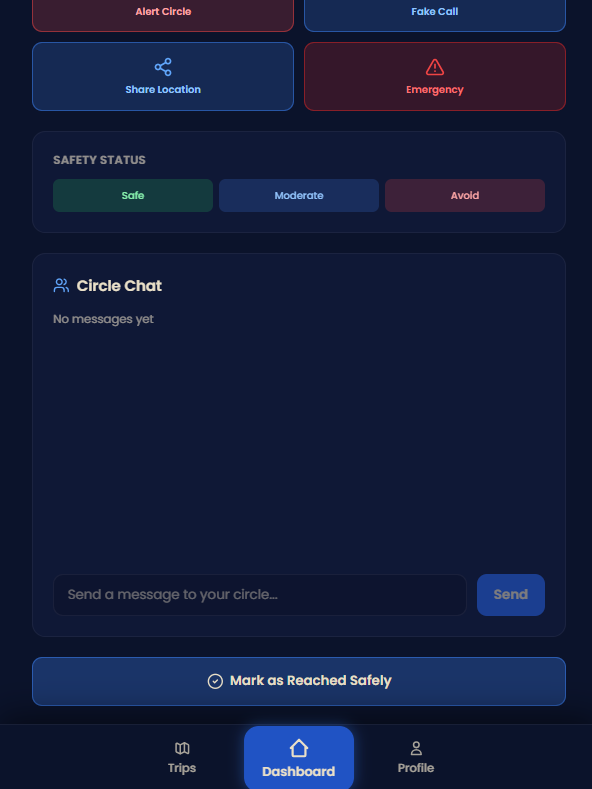

## App UI Preview

<table>
  <tr>
    <td width="50%" align="center">
      <strong>Dashboard</strong><br />
      
    </td>
    <td width="50%" align="center">
      <strong>Profile</strong><br />
      
    </td>
  </tr>
  <tr>
    <td width="50%" align="center">
      <strong>Circle</strong><br />
      
    </td>
    <td width="50%" align="center">
      <strong>Chat</strong><br />
      
    </td>
  </tr>
</table>

# SafeCircles 🛡️

**Real-time Safety Networks for Every Journey**

SafeCircles connects nearby users into temporary safety groups (SafeCircles) based on location, destination, and time. Powered by real-time matching, identity verification, and emergency tools transforming individual trips into collective safety journeys.

---

## Problem Statement

Physical safety remains a critical concern for women and marginalized groups traveling alone. Existing safety apps are reactive (calling police after danger) and provide no community support during travel. There's a gap: **real-time, peer-to-peer safety networks that form instantly during the journey itself.**

SafeCircles fills this gap by:
- Creating **instant communities** with verified peers heading the same direction
- Providing **live location sharing** within the group
- Enabling **emergency response** (alerts, fake calls, emergency contacts)
- Building **reputation systems** to ensure trust

---

## Solution Overview

SafeCircles is a progressive web app where:

1. **Users verify their identity** (face, head movement, voice) to build reputation
2. **Create trips** specifying source, destination, and time window
3. **Real-time matching engine** finds nearby users with overlapping routes
4. **SafeCircle forms automatically** when 2-5 verified matches are found
5. **Live tracking & emergency tools** activate for the journey
6. **Reputation scores** improve with each safe completion

### Core Innovation: Frontend-Driven Matching
Unlike traditional hailing apps, SafeCircles uses:
- **Geohash-based clustering** (7-character precision = ~150m accuracy)
- **Real-time Firestore listeners** for instant match updates
- **Zero server overhead** (all matching logic runs client-side)
- **Privacy-first design** (geohash precision prevents exact location exposure)

---

## Key Features

### 1. **Multi-Step Verification** (Anti-Fraud)
- **Face Detection**: MediaPipe facial recognition (detect spoofing attempts)
- **Head Movement**: Confirm live person via natural head rotation
- **Voice Analysis**: Pitch & voice pattern recognition (detect pre-recorded audio/deepfakes)
- Verification status stored with timestamp

### 3. **Trip Creation**
- Input source & destination (text-based with autocomplete support)
- Select departure time window (15-minute buffer)
- Choose circle preference (women-only / mixed)
- Automatic geohashing for both origin and destination

### 4. **Real-Time Matching Algorithm**
- Query trips with overlapping:
  - **Origin geohash** (same location cluster)
  - **Destination geohash** (same area)
  - **Time window** (±15 minutes departure)
- Deduplication to prevent duplicate matches
- Support for 2-5 member SafeCircles

### 5. **SafeCircle Formation**
- Automatic SafeCircle creation when matches found
- Display of all members with verification status
- Reputation scores for trust assessment
- Real-time Firestore listener for instant updates

### 6. **Live Map Integration**
- **OpenStreetMap tiles** (free, no API keys)
- Meeting point marker on map
- Live user location tracking (with permission)
- Distance & ETA calculation using Haversine formula
- 10-second location update intervals

### 7. **Emergency & Safety Tools**
| Feature | Function | Usage |
|---------|----------|-------|
| **Alert Circle** | Notify all members | Red-button panic alert |
| **Fake Call** | Simulate incoming call | Screen unwanted attention |
| **Share Location** | Send live tracking link | WhatsApp/native sharing |
| **Emergency Contacts** | Direct dial Police (100) / Women Helpline (1090) | India emergency numbers |
| **Safety Pings** | Report real-time status | Safe 🟢 / Moderate 🟡 / Avoid 🔴 |

### 8. **Live Location Tracking**
- Continuous geolocation updates (every 10 seconds)
- Geohash encoding (precision 6 = ~600m) for privacy
- Stored in Firestore `live_locations` collection
- Real-time map rendering of group position

### 9. **Trip Completion & Reputation**
- "Mark as Reached Safely" button triggers:
  - SafeCircle status → `completed`
  - All members +1 reputation score
  - Trip status → `completed`
  - Journey logged in `trip_logs` collection
- Auto-redirect to dashboard after completion

### 10. **Data Persistence & Offline Support**
- Firestore real-time listeners maintain state
- PWA-ready architecture (Service Worker foundation)
- Local state syncing for offline resilience

---

## Tech Stack

### Frontend (User App)
```
React 18              - Fast, real-time component updates
Vite 5.0              - Lightning-fast dev server (3s rebuild)
Tailwind CSS 3.3      - Premium dark theme glassmorphism UI
React Router 6        - SPA navigation
Lucide React          - Beautiful icon library
React Hot Toast       - Toast notifications
```

### Identity Verification (Browser-Native)
```
MediaPipe Face Mesh   - Face detection via CDN (no ML training needed)
Web Audio API         - Native audio stream processing
Canvas 2D API         - Real-time video frame analysis
Autocorrelation Algo  - Fundamental frequency (pitch) detection
```

### Real-Time Communication
```
Firestore Listeners   - WebSocket real-time updates
Firebase Auth         - Identity & session management
Cloud Messaging       - Push notification infrastructure (ready)
```

### Location & Mapping
```
Geolocation API       - GPS/WiFi position retrieval
ngeohash              - Location clustering (7-char precision)
Leaflet               - Map rendering
React-Leaflet         - React wrapper for Leaflet
OpenStreetMap Tiles   - Free map data (no API keys)
Haversine Formula     - Distance calculation (utilities)
```

### Backend (Cloud Functions)
```
Firebase Functions    - Node.js serverless compute
Firestore Database    - NoSQL document store
Firebase Storage      - Image/avatar storage
Firebase Admin SDK    - Server-side admin operations
```

---

## System Flow

### Complete User Journey
```
1. SIGNUP & VERIFICATION
   └─ Sign up with email → Multi-step identity check
      ├─ Face Detection (2 sec face hold confirm)
      ├─ Head Movement (rotations in 4 directions)
      └─ Voice Verification (speak 1 of 10 sentences)
   └─ Verification badge added to profile

2. TRIP CREATION
   └─ Dashboard → Enter source, destination, time
      └─ GPS pickup for coordinates
      └─ Generate geohash (precision 7) for origin & destination
      └─ Create trip document in Firestore
      └─ Status: "pending"

3. REAL-TIME MATCHING (Frontend)
   └─ Dashboard listener triggers findAndMatchTrips()
      ├─ Query all "pending" trips (exclude self)
      ├─ Filter: matching origin geohash
      ├─ Filter: matching destination geohash
      ├─ Filter: overlapping time window (±15 min)
      ├─ Deduplicate members (Set-based)
      └─ Result: 2-5 member match pool

4. SAFECIRCLE FORMATION
   └─ If matches found:
      ├─ Create safe_circles document
      ├─ Add member_ids array
      ├─ Set meeting_point (origin location)
      ├─ Set status: "matched"
      └─ Update all trip docs → link to circle_id

5. LIVE SAFECIRCLE
   └─ CirclePage loads for matched trip
      ├─ Real-time listener on safe_circles doc
      ├─ Display all members with verification badges
      ├─ Show meeting point + ETA
      ├─ Render live map with locations
      ├─ Enable emergency buttons:
      │  ├─ Alert Circle → writes alerts collection
      │  ├─ Fake Call → modal with "Mom" caller animation
      │  ├─ Share Location → WhatsApp/native share
      │  └─ Emergency → tel: links to 100/1090
      ├─ Safety Pings: Safe/Moderate/Avoid buttons
      └─ Live location tracking (every 10s, geohash precision 6)

6. TRIP COMPLETION
   └─ Member clicks "Mark as Reached Safely"
      ├─ Batch update:
      │  ├─ safe_circles.status = "completed"
      │  ├─ All users.reputation_score += 1
      │  ├─ All trips.status = "completed"
      │  └─ Create trip_logs entry
      ├─ Toast confirmation
      └─ Auto-redirect to dashboard (1.5s)
```

---

## Installation & Setup

### Prerequisites
- **Node.js 18+**
- **npm 9+** or **yarn**
- **Firebase Project** (free tier sufficient)
- **Modern browser** with geolocation & camera access

### Step 1: Clone Repository
```bash
git https://github.com/MONSTERBOY110/SafeCircles.git
cd SafeCircles
```

### Step 2: Install Dependencies
```bash
npm install
```

### Step 3: Configure Firebase
Create `.env.local` in the root directory:

```.env.local
# Firebase Configuration (from Firebase Console)
VITE_FIREBASE_API_KEY=your_api_key_here
VITE_FIREBASE_AUTH_DOMAIN=your_project.firebaseapp.com
VITE_FIREBASE_PROJECT_ID=your_project_id
VITE_FIREBASE_STORAGE_BUCKET=your_project.appspot.com
VITE_FIREBASE_MESSAGING_SENDER_ID=your_sender_id
VITE_FIREBASE_APP_ID=your_app_id

# (Optional) Uncomment for production
# VITE_ENVIRONMENT=production
```

**Get these values from Firebase Console:**
1. Go to Project Settings
2. Scroll to "Your apps" → Web app credentials
3. Copy the config object values

### Step 4: Run Development Server
```bash
npm run dev
```

Server starts at `http://localhost:3000`

### Step 5: Deploy (Optional)
```bash
# Build for production
npm run build

# Deploy to Firebase Hosting
firebase deploy

# Or deploy only Cloud Functions
firebase deploy --only functions
```

---

## Project Structure

```
SafeCircles/
├── src/
│   ├── components/
│   │   ├── Auth/                 # Login, Signup, Protected routes
│   │   ├── Circle/               # SafeCircle UI components
│   │   ├── Emergency/            # Alert, Fake Call, Emergency Contacts
│   │   ├── Verification/         # Face, Head, Voice verification
│   │   ├── Map/                  # Live map, Comfort map
│   │   ├── Profile/              # User profile, Settings, Reputation
│   │   ├── Trip/                 # Create, List, Details
│   │   └── Layout/               # Header, Navigation, Footer
│   │
│   ├── pages/
│   │   ├── Home.jsx              # Landing page
│   │   ├── Login.jsx             # Authentication
│   │   ├── Signup.jsx            # Registration
│   │   ├── Dashboard.jsx         # Trip creation + active circles
│   │   ├── CirclePage.jsx        # Live SafeCircle with emergency tools
│   │   ├── TripsPage.jsx         # Trip history & management
│   │   ├── ProfilePage.jsx       # User profile & settings
│   │   └── NotFound.jsx          # 404 page
│   │
│   ├── services/
│   │   ├── firebase.js           # Firebase initialization
│   │   ├── auth.js               # Authentication logic
│   │   ├── matching.js           # Core matching algorithm
│   │   ├── geolocation.js        # GPS & location services
│   │   ├── locationTracking.js   # Live location updates
│   │   ├── verification.js       # Verification data saving
│   │   ├── safety-ping.js        # Safety status tracking
│   │   ├── notifications.js      # Toast & alerts
│   │   └── tripCompletion.js     # Trip completion logic
│   │
│   ├── context/
│   │   ├── AppContext.jsx        # Global app state
│   │   ├── AuthContext.jsx       # User authentication state
│   │   └── VerificationContext.jsx
│   │
│   ├── hooks/
│   │   ├── useAuth.js            # Auth hook
│   │   ├── useCamera.js          # Camera access hook
│   │   ├── useGeolocation.js     # Location hook
│   │   ├── useMicrophone.js      # Audio hook
│   │   └── useRealTimeListener.js
│   │
│   ├── utils/
│   │   ├── constants.js          # App-wide constants
│   │   ├── geohash.js            # Geohashing utilities
│   │   ├── haversine.js          # Distance calculation
│   │   ├── coordinateUtils.js    # Lat/Lng helpers
│   │   ├── faceValidation.js     # Face detection validation
│   │   ├── pitchDetection.js     # Voice pitch analysis
│   │   ├── lipSyncDetection.js   # Lip-sync verification
│   │   └── timeUtils.js          # Date/time helpers
│   │
│   ├── styles/
│   │   ├── globals.css           # Global styles
│   │   ├── animations.css        # Transition animations
│   │   └── (Tailwind via config)
│   │
│   ├── App.jsx                   # Route configuration
│   ├── main.jsx                  # React DOM render
│   └── index.css                 # Root styles
│
├── backend/
│   ├── matchUsers.js             # Cloud Function for matching
│   ├── completeTrip.js           # Trip completion function
│   ├── cleanupExpiredTrips.js    # TTL cleanup (scheduled)
│   ├── reportIncident.js         # Incident logging
│   ├── utils/
│   │   ├── firebaseAdmin.js      # Admin SDK initialization
│   │   └── matching.js           # Shared matching logic
│   └── package.json
│
├── functions/                    # Compiled Cloud Functions
├── public/
│   └── manifest.json             # PWA manifest
│
├── .env.local                    # Firebase credentials
├── firebase.json                 # Firebase project config
├── firestore.rules               # Firestore security rules
├── firestore.indexes.json        # Database indexes
├── storage.rules                 # Firebase Storage rules
│
├── vite.config.js               # Build configuration
├── tailwind.config.js           # Tailwind CSS config
├── postcss.config.js            # PostCSS config
│
├── package.json                 # Dependencies
└── README.md                    # This file
```

## Firestore Collections

### `users`
```javascript
{
  uid: "user123",
  email: "user@example.com",
  name: "Alice",
  verification_status: "VERIFIED", // or "PENDING"
  verification_timestamp: Timestamp,
  reputation_score: 3,
  circle_preference: "women_only",
  created_at: Timestamp
}
```

### `trips`
```javascript
{
  userId: "user123",
  origin_landmark: "Coffee Shop A",
  destination_landmark: "Office B",
  origin_coords: { lat: 28.7041, lng: 77.1025 },
  dest_coords: { lat: 28.6139, lng: 77.2090 },
  origin_geohash: "ttme77", // precision 7
  dest_geohash: "ttme77",
  departure_window: { start: Timestamp, end: Timestamp },
  circle_type: "mixed",
  status: "matched", // pending, active, matched, completed
  circle_id: "circle123",
  created_at: Timestamp,
  expires_at: Timestamp
}
```

### `safe_circles`
```javascript
{
  member_ids: ["user1", "user2", "user3"],
  meeting_point: { name: "Coffee Shop A", lat: 28.7041, lng: 77.1025 },
  route_summary: "Coffee Shop A → Office B",
  status: "matched", // completed
  created_at: Timestamp,
  completedAt: Timestamp,
  estimated_departure: Timestamp
}
```

### `live_locations`
```javascript
{
  userId: "user123",
  geohash: "ttme7ued", // precision 6, ~600m
  updatedAt: timestamp (ms),
  lat: 28.7041, // optional, for debugging
  lng: 77.1025
}
```

### `alerts`
```javascript
{
  circleId: "circle123",
  triggeredBy: "user1",
  type: "circle_alert",
  timestamp: Timestamp
}
```

### `safety_pings`
```javascript
{
  userId: "user123",
  circleId: "circle123",
  status: "safe", // moderate, avoid
  geohash: "ttme7ued",
  timestamp: Timestamp
}
```

### `trip_logs` (History)
```javascript
{
  circleId: "circle123",
  completedAt: Timestamp,
  members: [{ uid: "user1", name: "Alice" }, ...]
}
```

### Data Protection
- ✅ Firebase ID tokens for authentication
- ✅ Firestore security rules (collection-level access control)
- ✅ Geohash precision (7 chars = ~150m, not exact address)
- ✅ No sensitive data logged (phone numbers, emails)

### Privacy Concerns Addressed
- Live location only visible to circle members
- Geohashing prevents point-level tracking
- Verification data encrypted in Firestore
- Temporary trip documents (90-minute TTL)
- Users can delete accounts & data on request

---

## Team & Credits

**Team Name:** TeesMaarKhaCoders

Built with ❤️ for safety, community, and trust.
